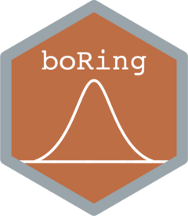

# boRing <a href="https://swarm-lab.github.io/boRing/"></a>

<!-- badges: start -->
[](https://CRAN.R-project.org/package=boRing)
[](https://github.com/swarm-lab/boRing/actions/workflows/R-CMD-check.yaml)
[](https://github.com/swarm-lab/boRing/actions/workflows/test-coverage.yaml)
<!-- badges: end -->

## Description

The goal of `boRing` is to provide an easy metric to determine whether a 
multivariate empirical distribution is likely unimodal (that is, a boring 
distribution) or not. The "boringness" index is based on the idea that the 
density of observations should decrease monotonically with the the distance to 
the center of mass of an unimodal empirical distribution.

The computation of the "boringness" index is done as follows: 

1. We compute the center of mass and the covariance matrix of the empirical 
distribution (weighted observations are allowed in `boRing`).

2. From the center of mass and the covariance matrix, we compute the Mahalanobis
distance of each observation to the center of mass of the distribution.

3. We order the observations based on their Mahalanobis distance (from closest
to furthest away).

4. We compute the Spearman correlation between the negative Mahalanobis 
distances of the ordered observations and the weighted density of the 
observations up to each computed distance. If the correlation is close to 1, it 
indicates that the density of observations decreases monotonically with the 
distance to the center of mass of the distribution and, hence, that the 
distribution is likely unimodal (or, boring). 

---

## Installation

At this time, `boRing` is not yet available on CRAN. 

You can install the development version of boRing from 
[GitHub](https://github.com/) with:

``` r
# install.packages("devtools")
devtools::install_github("swarm-lab/boRing")
```

---

## Performance tip

`boRing` depends on [`RcppEigen`](https://github.com/RcppCore/RcppEigen) for 
computing efficiently the weighted covariance matrix of the empirical 
distribution as well as the Mahalanobis distances of the observations. Provided
that your compiler allows it, a significant performance increase can be obtained
by adding the `-O3` optimization flag to the `CXXFLAGS` line in your local
`.R/Makevars` file. If you don't know where your local `.R/Makevars` file is 
located, install the [`usethis`](https://usethis.r-lib.org/) package and then 
run `usethis::edit_r_makevars()`.

---

## Example

``` r
library(MASS)
library(ggplot2)
library(patchwork)
library(boRing)

distr1 <- mvrnorm(500, c(0, 0), matrix(c(3, 0.5, 0.5, 1), 2, 2))
distr2 <- mvrnorm(500, c(0, 0), matrix(c(3, 0.5, 0.5, 1), 2, 2))

xlim <- c(min(distr1[, 1], distr2[, 1]), max(distr1[, 1], distr2[, 1]) + 8)
ylim <- c(min(distr1[, 2], distr2[, 2]), max(distr1[, 2], distr2[, 2]) + 8)

g <- lapply(0:8, function(offset) {
  dt <- data.frame(
    x = c(distr1[, 1], distr2[, 1] + offset),
    y = c(distr1[, 2], distr2[, 2] + offset),
    dist = c(rep("A", nrow(distr1)), rep("B", nrow(distr1)))
  )

  idx <- boring(dt[, 1:2])

  ggplot(dt) +
    aes(x, y) +
    stat_density_2d(aes(fill = after_stat(level)),
      geom = "polygon",
      n = 100, bins = 10, show.legend = FALSE
    ) +
    geom_point(aes(color = dist), size = 1, alpha = 0.25) +
    labs(title = paste0("Boringness index: ", round(idx, 3))) +
    coord_equal(xlim = xlim, ylim = ylim) +
    scale_fill_viridis_c(option = "plasma") +
    scale_color_brewer(palette = "Dark2") +
    theme_bw() +
    theme(legend.position = "none")
})

wrap_plots(g)
```


